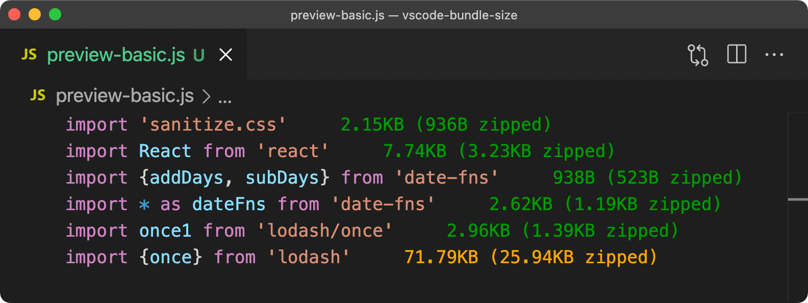
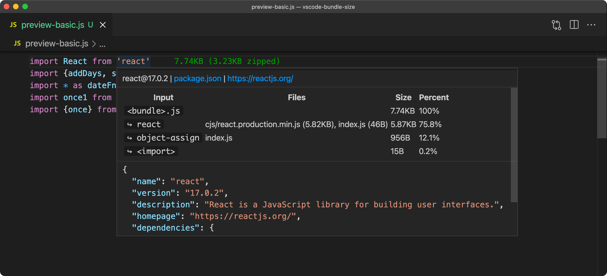

# bundle-size

Display the bundle size of npm packages.

## Features

- Lightning fast, instantly show bundle result, powered by [esbuild](https://github.com/evanw/esbuild)
- Support JSX/Typescript/CSS
- For namespace (`* as`) imports, only count in-use properties
- Bundle in memory and locally, no file writing, no extra installation
- Provide hover card of bundle statistics

Preview basic usage:



Preview namespace imports:


Preview hover card:



## Requirements

Because this extension builds locally, you need to pre-install dependencies.

## Extension Settings

```jsonc
{
  "bundleSize.cache": {
    "type": "boolean",
    "default": true,
    "description": "Whether to cache the bundle result (it's highly recommended to turn on, unless you are debugging or want to edit files in dependencies)"
  },
  "bundleSize.cautionSize": {
    "type": "number",
    "default": 50,
    "description": "Size limit in KB, display caution color if exceeded"
  },
  "bundleSize.dangerSize": {
    "type": "number",
    "default": 100,
    "description": "Size limit in KB, display danger color if exceeded"
  },
  "bundleSize.infoColor": {
    "type": "string",
    "default": "#090",
    "description": "Info (default) color for the size text"
  },
  "bundleSize.cautionColor": {
    "type": "string",
    "default": "#ea0",
    "description": "Caution color for the size text"
  },
  "bundleSize.dangerColor": {
    "type": "string",
    "default": "#e33",
    "description": "Danger color for the size text"
  }
}
```

## Known Issues

- Only import declaration is supported (no plan for `require()` statement)
